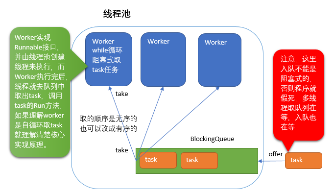
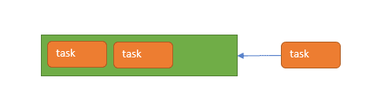
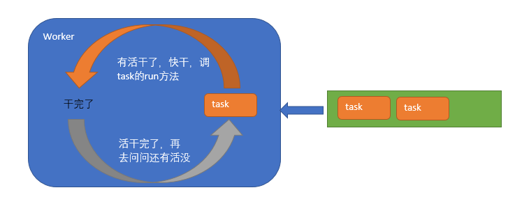
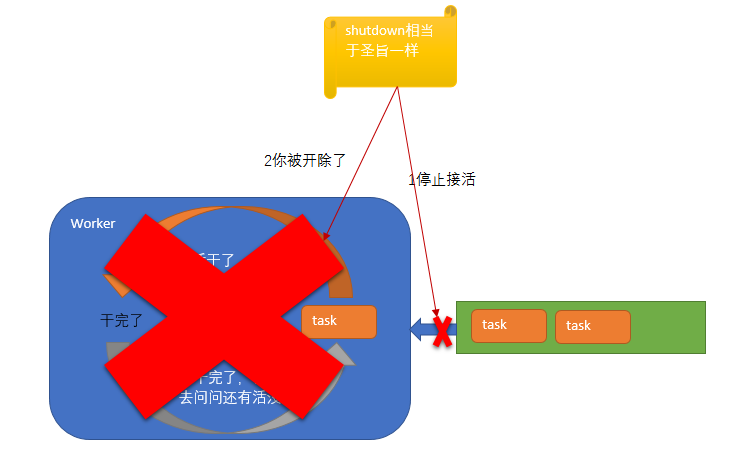

# 自定义线程池

## 1.原理图





### 线程池构造的核心几个点

1. 线程池里的核心线程数与最大线程数
2. 线程池里真正工作的线程`worker`
3. 线程池里用来存取任务的队列`BlockingQueue`
4. 线程中的任务`task`


这个Worker是个内部类，是在线程池内声明的。

### exec方法



### **Worker怎么工作**



### **shutdown()**




## 2.代码实现

```java
package com.example.demo;


import java.util.ArrayList;
import java.util.HashSet;
import java.util.List;
import java.util.concurrent.BlockingQueue;
import java.util.concurrent.LinkedBlockingQueue;

public class ThreadExcutor {
    public static void main(String[] args) {
        ThreadExcutor excutor = new ThreadExcutor(2);
        for (int i = 0; i < 10; i++) {
            excutor.exec(() -> {
                System.out.println("线程 " + Thread.currentThread().getName() + " 在帮我干活");
            });
        }
    }
    //创建
    private volatile boolean RUNNING = true;

    //所有任务都放队列中，让工作线程来消费
    private static BlockingQueue<Runnable> queue = null;

    private final HashSet<Worker> workers = new HashSet<Worker>();

    private final List<Thread> threadList = new ArrayList<Thread>();

    //工作线程数
    int poolSize = 0;
    //核心线程数（创建了多少个工作线程）
    int coreSize = 0;

    boolean shutdown = false;

    public ThreadExcutor(int poolSize) {
        this.poolSize = poolSize;
        queue = new LinkedBlockingQueue<Runnable>(poolSize);
    }

    public void exec(Runnable runnable) {
        if (runnable == null) throw new NullPointerException();
        if (coreSize < poolSize) {
            addThread(runnable);
        } else {
            //System.out.println("offer" +  runnable.toString() + "   " + queue.size());
            try {
                queue.put(runnable);
            } catch (InterruptedException e) {
                e.printStackTrace();
            }
        }
    }

    public void addThread(Runnable runnable) {
        coreSize++;
        queue.offer(runnable);
        Worker worker = new Worker();
        workers.add(worker);

        Thread t = new Thread(worker);
        threadList.add(t);
        try {
            t.start();
        } catch (Exception e) {
            e.printStackTrace();
        }

    }

    public void shutdown() {
        RUNNING = false;
        if (!workers.isEmpty()) {
            for (Worker worker : workers) {
                worker.interruptIfIdle();
            }
        }
        shutdown = true;
        Thread.currentThread().interrupt();
    }

    /**
     * 工作线程
     */
    class Worker implements Runnable {


        @Override
        public void run() {
            while (RUNNING) {
                if (shutdown) {
                    Thread.interrupted();
                }
                Runnable task = null;
                try {
                    task = getTask();
                    task.run();
                } catch (InterruptedException e) {
                    e.printStackTrace();
                }
            }
        }

        public Runnable getTask() throws InterruptedException {
            return queue.take();
        }

        public void interruptIfIdle() {
            for (Thread thread : threadList) {
                System.out.println(thread.getName() + " interrupt");
                thread.interrupt();
            }
        }
    }
}
```