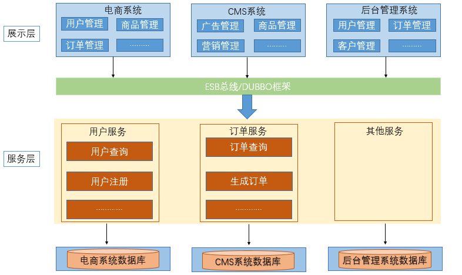
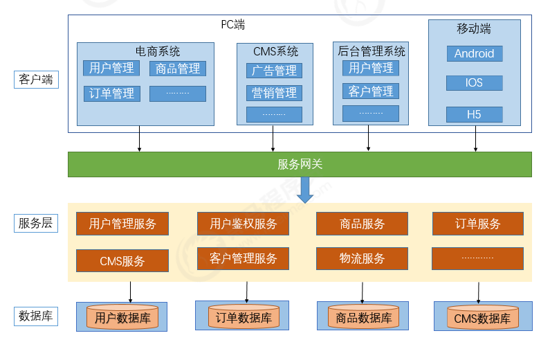
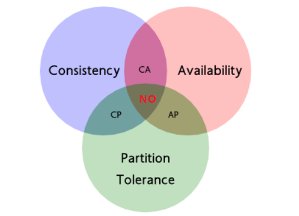
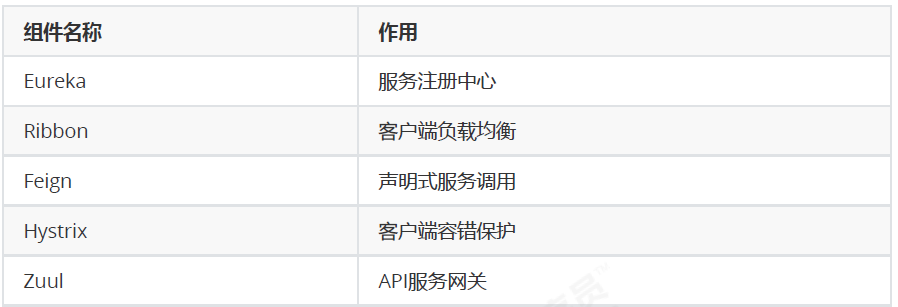
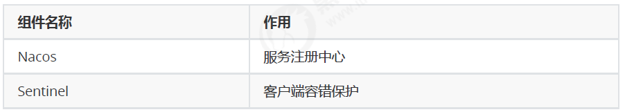
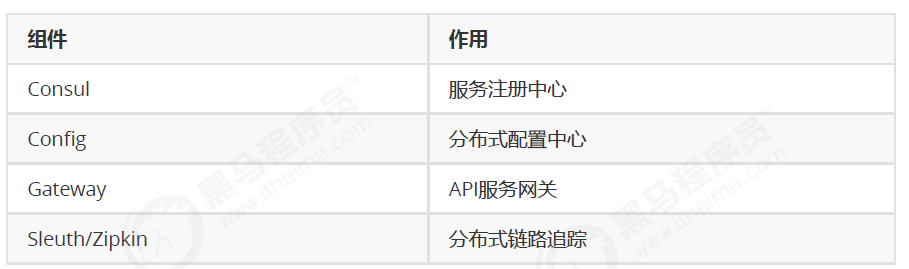
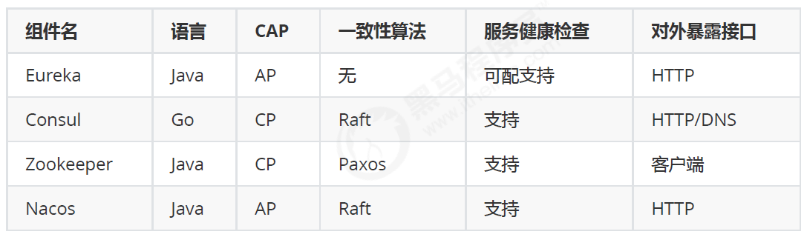
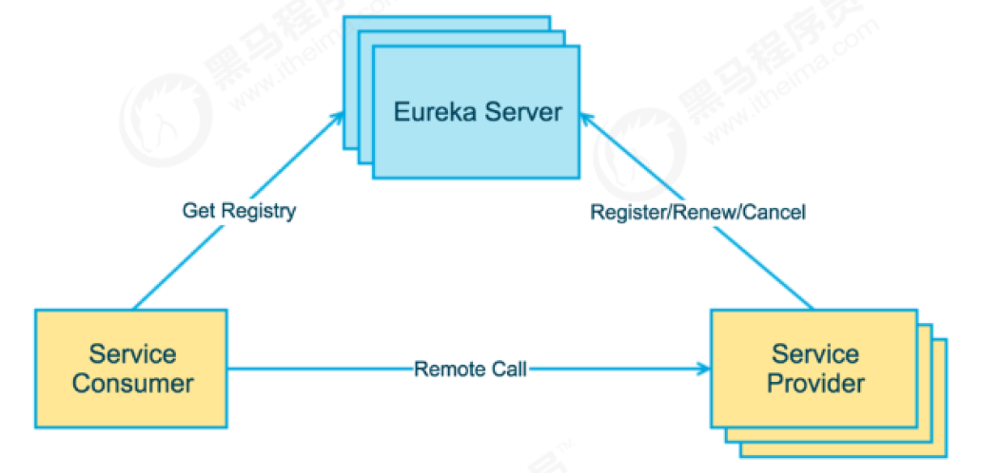
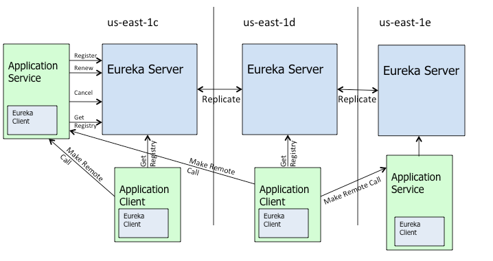
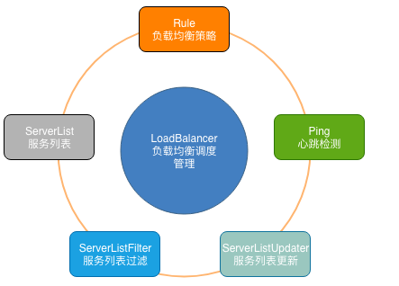

# 架构演化,注册中心,服务调用,负载均衡

# 1 微服务基础知识

## 1.1 系统架构的演变

### 1.1.1 单体应用架构

**优点：**

- 所有的功能集成在一个项目工程中
- 项目架构简单，前期开发成本低，周期短，小型项目的首选。

**缺点：**

- 全部功能集成在一个工程中，对于大型项目不易开发、扩展及维护。

- 系统性能扩展只能通过扩展集群结点，成本高、有瓶颈。

- 技术栈受限。

  

### 1.1.2 垂直应用架构

当访问量逐渐增大，单一应用增加机器带来的加速度越来越小，将应用拆成互不相干的几个应用，以提
升效率

**优点：**

- 项目架构简单，前期开发成本低，周期短，小型项目的首选。
- 通过垂直拆分，原来的单体项目不至于无限扩大
- 不同的项目可采用不同的技术。

**缺点：**

- 全部功能集成在一个工程中，对于大型项目不易开发、扩展及维护。
- 系统性能扩展只能通过扩展集群结点，成本高、有瓶颈。

### 1.1.3 分布式SOA架构

 SOA 有如下几个特点：分布式、可重用、扩展灵活、松耦合

**优点：**

- 抽取公共的功能为服务,提高开发效率
- 对不同的服务进行集群化部署解决系统压力
- 基于ESB/DUBBO减少系统耦合

**缺点：**

- 抽取服务的粒度较大
- 服务提供方与调用方接口耦合度较高

### 1.1.4 微服务架构

**优点：**

- 通过服务的原子化拆分，以及微服务的独立打包、部署和升级，小团队的交付周期将缩短，运维成
  本也将大幅度下降
- 微服务遵循单一原则。微服务之间采用Restful等轻量协议传输。

**缺点：**

- 微服务过多，服务治理成本高，不利于系统维护。
- 分布式系统开发的技术成本高（容错、分布式事务等）。

#### 1.1.5 SOA与微服务的关系

- SOA（ Service Oriented Architecture ）“面向服务的架构”

- 微服务架构:其实和 SOA 架构类似,微服务是在 SOA 上做的升华，微服务架构强调的一个重点是“业务需
  要彻底的组件化和服务化”
  
  

### 1.2.2 分布式中的CAP原理

分布式系统基
础设施的，如服务发现注册、配置中心、消息总线、负载均衡、断路器、数据监控等

### 1.3 常见微服务框架

1. **SpringCloud netflix**
2. **ServiceComb -> serive Mesh代表**
3.  **ZeroC ICE**
4. **springcloud alibaba**

   

# 2 SpringCloud概述

## 2.1 微服务中的相关概念

1. **服务注册与发现**
2. **负载均衡**
3. **熔断**
4.  **链路追踪**
5. **API网关**

### 2.2 SpringCloud的介绍

### 2.3 SpringCloud的架构

#### 2.3.1 SpringCloud中的核心组件

##### Spring Cloud Netflix组件

##### Spring Cloud Alibaba组件

##### Spring Cloud原生及其他组件

# 3 服务注册Eureka基础

## 3.1 微服务的注册中心

### 3.1.1 注册中心的主要作用

#### **1.服务发现：**

- 服务注册/反注册：保存服务提供者和服务调用者的信息
- 服务订阅/取消订阅：服务调用者订阅服务提供者的信息，最好有实时推送的功能
- 服务路由（可选）：具有筛选整合服务提供者的能力。

#### **2.服务配置：**

- 配置订阅：服务提供者和服务调用者订阅微服务相关的配置
- 配置下发：主动将配置推送给服务提供者和服务调用者

#### **3.服务健康检测**

- 检测服务提供者的健康情况

### 3.1.2 常见的注册中心

#### Zookeeper

采用Paxos算法保证一致性

#### Eureka

#### Consul

采用Raft算法保证服务的一致性，且支持健康检查。

#### Nacos

采用Raft算法保证服务的一致性

### 3.2 Eureka的概述

#### 3.2.1 Eureka的基础知识

##### 1、Eureka Server

提供服务注册和发现

##### 2、Service Provider

服务提供方
将自身服务注册到Eureka，从而使服务消费方能够找到

##### 3、Service Consumer

服务消费方
从Eureka获取注册服务列表，从而能够消费服务

#### 3.2.2 Eureka的交互流程与原理

- Application Service 相当于本书中的服务提供者，Application Client相当于服务消费者；
- Make Remote Call，可以简单理解为调用RESTful API；
- us-east-1c、us-east-1d等都是zone，它们都属于us-east-1这个region；

## 4 服务注册Eureka高级

### 4.1 Eureka Server 高可用集群

### 4.2 Eureka中的常见问题

#### 4.2.1 服务注册慢

默认情况下，服务注册到Eureka Server的过程较慢。

可以通过配置
eureka.instance.leaseRenewalIntervalInSeconds (心跳频率)加快客户端连接到其他服务的过

#### 4.2.2 服务节点剔除问题

不能有效而迅速的剔除失效节点，这对开发或测试会造成困扰。解决方案如下：

- 配置关闭自我保护，设置剔除无效节点的时间间隔
- 配置开启健康检查，并设置续约时间

#### 4.2.3 监控页面显示ip

服务实例名称默认情况下是微服务定义的名称和端口。为了更好
的对所有服务进行定位，微服务注册到Eureka Server的时候可以手动配置示例ID

### 4.3 Eureka源码解析

#### 4.3.1 SpringBoot中的自动装载

##### （1）ImportSelector

#### 4.3.2 Eureka服务注册核心源码解析

##### 4.3.2.1 EnableEurekaServer注解作用

##### 4.3.2.2 自动装载核心配置类

##### 4.3.2.3 EurekaServerInitializerConfiguration

##### 4.3.2.4 EurekaServerAutoConfiguration

##### 4.3.2.5 暴露的服务端接口

##### 4.3.2.6 服务剔除

#### 4.3.3 Eureka服务发现核心源码解析

##### 4.3.3.1 自动装载

##### 4.3.3.2 服务注册

##### 4.3.3.3 服务下架

##### 4.3.3.4 心跳续约

# 5 Eureka替换方案

## 5.1 Eureka闭源的影响

### 5.1.1 Eureka闭源影响

在Euraka的GitHub上，宣布Eureka 2.x闭源。近这意味着如果开发者继续使用作为 2.x 分支上现有工作
repo 一部分发布的代码库和工件，则将自负风险。

### 5.1.2 Eureka的替换方案

1. #### Zookeeper

2. #### Consul

   

   **特性：**
   服务发现
   健康检查
   Key/Value 存储
   多数据中心

3. #### Nacos

   

##### **Consul 的优势：**

使用 Raft 算法来保证一致性, 比复杂的 Paxos 算法更直接. 相比较而言, zookeeper 采用的是
Paxos, 而 etcd 使用的则是 Raft。

支持多数据中心，内外网的服务采用不同的端口进行监听。 多数据中心集群可以避免单数据中心
的单点故障,而其部署则需要考虑网络延迟, 分片等情况等。 zookeeper 和 etcd 均不提供多数据中
心功能的支持。

支持健康检查。 etcd 不提供此功能。

支持 http 和 dns 协议接口。 zookeeper 的集成较为复杂, etcd 只支持 http 协议。
官方提供 web 管理界面, etcd 无此功能。

Consul 使用 Go 语言编写，因此具有天然可移植性(支持Linux、windows和
Mac OS X)；安装包仅包含一个可执行文件，方便部署，与 Docker 等轻量级容器可无缝配合。

综合比较, Consul 作为服务注册和配置管理的新星, 比较值得关注和研究。

##### 5.6.3 Consul 常见问题

（1）节点和服务注销

当服务或者节点失效，Consul不会对注册的信息进行剔除处理，仅仅标记已状态进行标记（并且不可使
用）。如果担心失效节点和失效服务过多影响监控。可以通过调用HTTP API的形式进行处理

如果某个节点不继续使用了，也可以在本机使用consul leave命令，或者在其它节点使用consul forceleave
节点Id。

（2）健康检查与故障转移

在集群环境下，健康检查是由服务注册到的Agent来处理的，那么如果这个Agent挂掉了，那么此节点
的健康检查就处于无人管理的状态。

从实际应用看，节点上的服务可能既要被发现，又要发现别的服务，如果节点挂掉了，仅提供被发现的
功能实际上服务还是不可用的。当然发现别的服务也可以不使用本机节点，可以通过访问一个Nginx实
现的若干Consul节点的负载均衡来实现。

# 6 服务调用Ribbon入门

如何更加方便的调用微服务，多个微服务的提供者如何选择，如何负载均
衡等。

## 6.2 Ribbon概述

### 6.2.1 什么是Ribbon

Ribbon提供了客户端负载均衡的功能，Ribbon利用从Eureka中读
取到的服务信息，在调用服务节点提供的服务时，会合理的进行负载。

#### 6种负载均衡算法

##### **1、轮询法**

**2、随机法**

##### **3、源地址哈希法**

##### **4、加权轮询法**

##### **5、加权随机法**

##### **6、最小连接数法**

### 6.2.2 Ribbon的主要作用

### （1）服务调用

### （2）负载均衡

# 7 服务调用Ribbon高级

## 7.1 负载均衡概述

### 7.1.1 什么是负载均衡

按照指定的负载均衡算
法，将流量分配到后端服务集群上，从而为系统提供并行扩展的能力

### 7.1.2 客户端负载均衡与服务端负载均衡

#### 服务端负载均衡

先发送请求到负载均衡服务器或者软件，然后通过负载均衡算法，在多个服务器之间选择一个进行访
问；即在服务器端再进行负载均衡算法分配

#### 客户端负载均衡

客户端会有一个服务器地址列表，在发送请求前通过负载均衡算法选择一个服务器，然后进行访问，这
是客户端负载均衡；即在客户端就进行负载均衡算法分配

## 7.2 基于Ribbon实现负载均衡

### 7.2.1 搭建多服务实例

### 7.2.2 负载均衡策略

Ribbon内置了多种负载均衡策略，内部负责复杂均衡的顶级接口为
com.netflix.loadbalancer.IRule ，实现方式如下

1. **com.netflix.loadbalancer.RoundRobinRule ：以轮询的方式进行负载均衡。**
2. **com.netflix.loadbalancer.RandomRule ：随机策略**
3. **com.netflix.loadbalancer.RetryRule ：重试策略。**
4. **com.netflix.loadbalancer.WeightedResponseTimeRule ：权重策略。会计算每个服务的权**
   **重，越高的被调用的可能性越大。**
5. **com.netflix.loadbalancer.BestAvailableRule ：最佳策略。遍历所有的服务实例，过滤掉**
   **故障实例，并返回请求数最小的实例返回。**
6. **com.netflix.loadbalancer.AvailabilityFilteringRule ：可用过滤策略。过滤掉故障和请**
   **求数超过阈值的服务实例，再从剩下的实力中轮询调用**

## 7.3 Ribbon中负载均衡的源码解析

### 7.3.1 Ribbon中的关键组件

- ServerList：可以响应客户端的特定服务的服务器列表。
- ServerListFilter：可以动态获得的具有所需特征的候选服务器列表的过滤器。
- ServerListUpdater：用于执行动态服务器列表更新。
- Rule：负载均衡策略，用于确定从服务器列表返回哪个服务器。
- Ping：客户端用于快速检查服务器当时是否处于活动状态。
- LoadBalancer：负载均衡器，负责负载均衡调度的管理。

### 7.3.2 @LoadBalanced注解

使用Ribbon完成客户端负载均衡往往是从一个注解开始的

通过注释可以知道@LoadBalanced注解是用来给RestTemplate做标记，方便我们对RestTemplate添加
一个LoadBalancerClient，以实现客户端负载均衡。

### 7.3.3 自动装配

### 7.3.4 负载均衡调用

