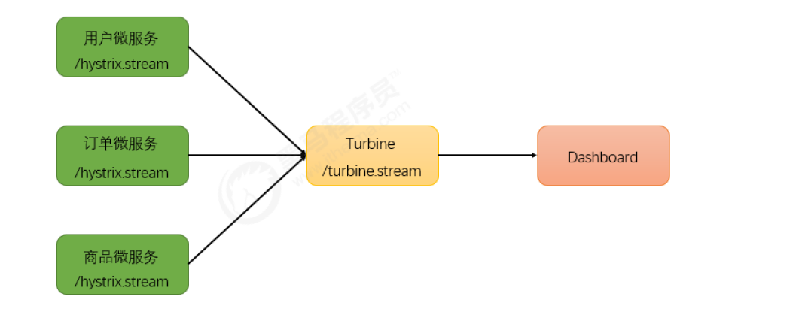
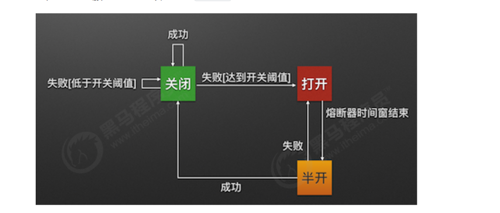
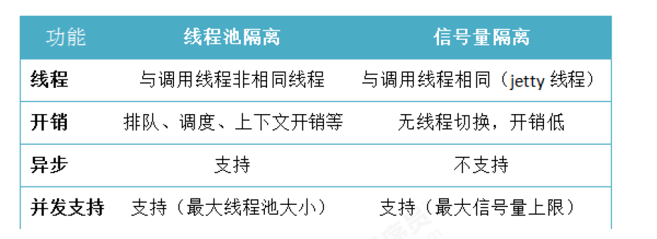
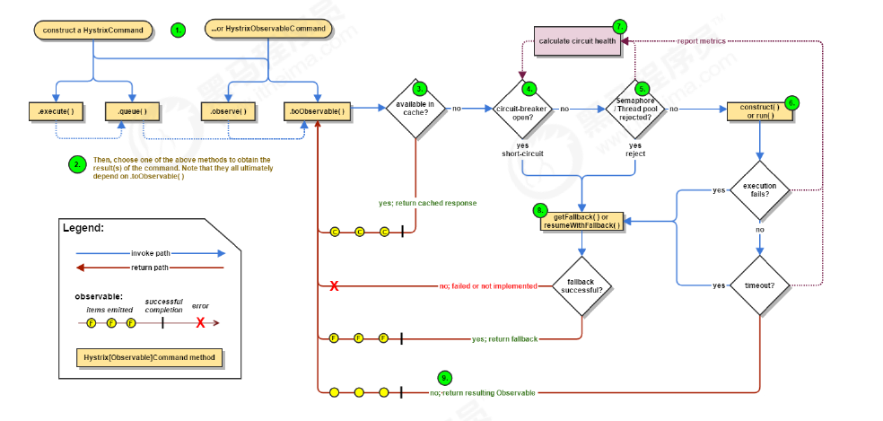
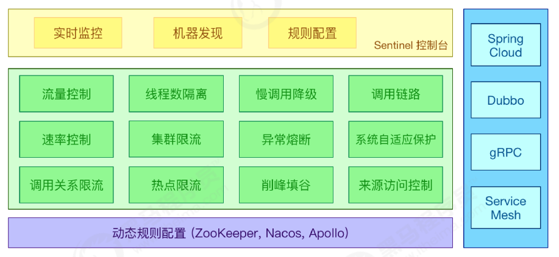

# 服务调用2,服务发现,熔断

## 1 服务调用Feign入门

### 1.1 Feign简介

- Feign支持多种注解，例如Feign自带的注解或者JAX-RS注解等。

- SpringCloud对Feign进行了增强，使Feign支持了SpringMVC注解，并整合了Ribbon和Eureka，hystrix
  从而让Feign的使用更加方便。

- 注意:Feign天生继承了Ribbon的负载均衡,不需要特意加@LoadBalanced注解

  它跟Euraka,Consul都是继承了Ribbon

## 2 服务调用Feign高级

### 2.1 Feign的配置

从Spring Cloud Edgware开始，Feign支持使用属性自定义Feign。对于一个指定名称的Feign
Client（例如该Feign Client的名称为feignName ）

### 2.2 请求压缩

Spring Cloud Feign 支持对请求和响应进行GZIP压缩，以减少通信过程中的性能损耗

### 2.3 日志级别

在开发或者运行阶段往往希望看到Feign请求过程的日志记录，默认情况下Feign的日志是没有开启的。
要想用属性配置方式来达到日志效果，只需在application.yml 中添加

### 2.4 源码分析

#### （1）EnableFeignClients注解

#### （2）FeignClientsRegistrar注册类

#### （3） 注册FeignClient对象

#### （4） FeignClientFactoryBean类

#### （5） 发送请求

## 3 服务注册与发现总结

### 3.1 组件的使用方式

#### 3.1.1 注册中心

#### （1）Eureka

- 搭建注册中心

​         引入依赖spring-cloud-starter-netflix-eureka-server

​         配置EurekaServer

​         通过@EnableEurekaServer 激活Eureka Server端配置

- 服务注册

​         服务提供者引入spring-cloud-starter-netflix-eureka-client 依赖
​         通过eureka.client.serviceUrl.defaultZone 配置注册中心地址

#### （2）consul

- 搭建注册中心

  下载安装consul
   启动consul consul agent -dev

- 服务注册

​       服务提供者引入spring-cloud-starter-consul-discovery 依赖
​       通过spring.cloud.consul.host 和spring.cloud.consul.port 指定Consul Server的请求地址

#### 3.1.2 服务调用

**（1）Ribbon**

- 通过Ribbon结合RestTemplate方式进行服务调用只需要在声明RestTemplate的方法上添加注解@LoadBalanced即可
- 可以通过{服务名称}.ribbon.NFLoadBalancerRuleClassName 配置负载均衡策略

**（2）Feign**

- 服务消费者引入spring-cloud-starter-openfeign 依赖
- 通过@FeignClient 声明一个调用远程微服务接口
- 启动类上通过@EnableFeignClients 激活Feign

## 4 微服务架构的高并发问题

### 4.1 性能工具Jmetter

### 4.2 系统负载过高存在的问题

#### 4.2.1 问题分析

- 服务并不能保证服务的100%可用
- 单tomcat支持最大的并发请求有限

#### 4.2.2 线程池的形式实现服务隔离

## 5 服务熔断Hystrix入门

### 5.1 服务容错的核心知识

#### 5.1.1 雪崩效应

#### 5.1.2 服务隔离

#### 5.1.3 熔断降级

#### 5.1.4 服务限流

### 5.2 Hystrix介绍

Hystrix主要通过以下几点实现延迟和容错。

- 包裹请求：使用HystrixCommand包裹对依赖的调用逻辑，每个命令在独立线程中执行。这使用
  了设计模式中的“命令模式”。
- 跳闸机制：当某服务的错误率超过一定的阈值时，Hystrix可以自动或手动跳闸，停止请求该服务
  一段时间。
- 资源隔离：Hystrix为每个依赖都维护了一个小型的线程池（或者信号量）。如果该线程池已满，
  发往该依赖的请求就被立即拒绝，而不是排队等待，从而加速失败判定。
- 监控：Hystrix可以近乎实时地监控运行指标和配置的变化，例如成功、失败、超时、以及被拒绝
  的请求等。
- 回退机制：当请求失败、超时、被拒绝，或当断路器打开时，执行回退逻辑。回退逻辑由开发人员
- 自行提供，例如返回一个缺省值。
- 自我修复：断路器打开一段时间后，会自动进入“半开”状态。

### 5.3 Rest实现服务熔断

### 5.4 Feign实现服务熔断

SpringCloud Fegin默认已为Feign整合了hystrix，所以添加Feign依赖后就不用在添加hystrix

## 6 服务熔断Hystrix高级

### 6.1 Hystrix的监控平台

#### 6.1.1 搭建Hystrix DashBoard监控

#### 6.1.2断路器聚合监控Turbine

Turbine是一个聚合Hystrix 监控数据的工具，他可以将所有相关微服务的
Hystrix 监控数据聚合到一起，方便使用。引入Turbine后，整个监控系统架构如下

### 6.2 熔断器的状态

熔断器有三个状态 CLOSED 、OPEN 、HALF_OPEN

### 6.3 熔断器的隔离策略

#### 线程池隔离策略

#### 信号量隔离策略

### 6.4 Hystrix的核心源码

Hystrix 底层基于 RxJava，RxJava 是响应式编程开发库，把一
个HystrixCommand封装成一个Observable（待观察者），针对自身要实现的核心功能，对
Observable进行各种装饰，并在订阅各步装饰的Observable，以便在指定事件到达时，添加自己的业
务。

**Hystrix主要有4种调用方式：**

- toObservable() 方法 ：未做订阅，只是返回一个Observable 。
- observe() 方法 ：调用 #toObservable() 方法，并向 Observable 注册 rx.subjects.ReplaySubject
  发起订阅。
- queue() 方法 ：调用 #toObservable() 方法的基础上，调用：Observable#toBlocking() 和
  BlockingObservable#toFuture() 返回 Future 对象
- execute() 方法 ：调用 #queue() 方法的基础上，调用 Future#get() 方法，同步返回 #run() 的执
  行结果。

**主要的执行逻辑：**

1. 每次调用创建一个新的HystrixCommand,把依赖调用封装在run()方法中.
2. 执行execute()/queue做同步或异步调用.
3. 判断熔断器(circuit-breaker)是否打开,如果打开跳到步骤8,进行降级策略,如果关闭进入步骤.
4. 判断线程池/队列/信号量是否跑满，如果跑满进入降级步骤8,否则继续后续步骤.
5. 调用HystrixCommand的run方法.运行依赖逻辑，依赖逻辑调用超时,进入步骤8.
6. 判断逻辑是否调用成功。返回成功调用结果；调用出错，进入步骤8.
7. 计算熔断器状态,所有的运行状态(成功, 失败, 拒绝,超时)上报给熔断器，用于统计从而判断熔断器
状态.
8. getFallback()降级逻辑。以下四种情况将触发getFallback调用：
1. run()方法抛出非HystrixBadRequestException异常。
2. run()方法调用超时
3. 熔断器开启拦截调用
4. 线程池/队列/信号量是否跑满
5. 没有实现getFallback的Command将直接抛出异常，fallback降级逻辑调用成功直接返回，降
级逻辑调用失败抛出异常.
9. 返回执行成功结果

#### 6.4.1 HystrixCommand注解

#### 6.4.2 环绕通知增强

## 7 服务熔断Hystrix的替换方案

### 7.1 替换方案介绍

#### Alibaba Sentinel

Sentinel 是阿里巴巴开源的一款断路器实现，目前在Spring Cloud的孵化器项目Spring Cloud Alibaba
中的一员Sentinel本身在阿里内部已经被大规模采用，非常稳定。因此可以作为一个较好的替代品。

#### Resilience4J

一款非常轻量、简单，并且文档非常清晰、丰富的熔断工具，这也是Hystrix官方推荐的
替代产品。不仅如此，Resilicence4j还原生支持Spring Boot 1.x/2.x，而且监控也不像Hystrix一样弄
Dashboard/Hystrix等一堆轮子，而是支持和Micrometer（Pivotal开源的监控门面，Spring Boot 2.x
中的Actuator就是基于Micrometer的）、prometheus（开源监控系统，来自谷歌的论文）、以及
Dropwizard metrics（Spring Boot曾经的模仿对象，类似于Spring Boot）进行整合。

### 7.2 Sentinel概述

#### 7.2.1 Sentinel简介

Sentinel 以流量为切入点，从流量控
制、熔断降级、系统负载保护等多个维度保护服务的稳定性。

##### **Sentinel 具有以下特征:**

###### **丰富的应用场景：**

Sentinel 承接了阿里巴巴近 10 年的双十一大促流量的核心场景，例如秒杀（即
突发流量控制在系统容量可以承受的范围）、消息削峰填谷、集群流量控制、实时熔断下游不可用
应用等。

###### **完备的实时监控：**

Sentinel 同时提供实时的监控功能。您可以在控制台中看到接入应用的单台机
器秒级数据，甚至 500 台以下规模的集群的汇总运行情况。

###### **广泛的开源生态：**

Sentinel 提供开箱即用的与其它开源框架/库的整合模块，例如与 Spring
Cloud、Dubbo、gRPC 的整合。您只需要引入相应的依赖并进行简单的配置即可快速地接入
Sentinel。

###### **完善的 SPI 扩展点：**

Sentinel 提供简单易用、完善的 SPI 扩展接口。您可以通过实现扩展接口来快
速地定制逻辑。例如定制规则管理、适配动态数据源等。

##### Sentinel 的主要特性：

#### 7.2.2 Sentinel与Hystrix的区别

#### 7.2.3 迁移方案

Sentinel官方提供了详细的由Hystrix 迁移到Sentinel 的方法

### 7.3 Sentinel中的管理控制台

### 7.4 基于Sentinel的服务保护

#### 7.4.1 通用资源保护

#### 7.4.2 Rest实现熔断

Spring Cloud Alibaba Sentinel 支持对 RestTemplate 的服务调用使用 Sentinel 进行保护，在构造
RestTemplate bean的时候需要加上 @SentinelRestTemplate 注解。

#### 7.4.3 Feign实现熔断

Sentinel 适配了 Feign 组件。如果想使用，除了引入 sentinel-starter 的依赖外还需要 2 个步骤：

- 配置文件打开 sentinel 对 feign 的支持： feign.sentinel.enabled=true
- 加入 openfeign starter 依赖使 sentinel starter 中的自动化配置类生效：