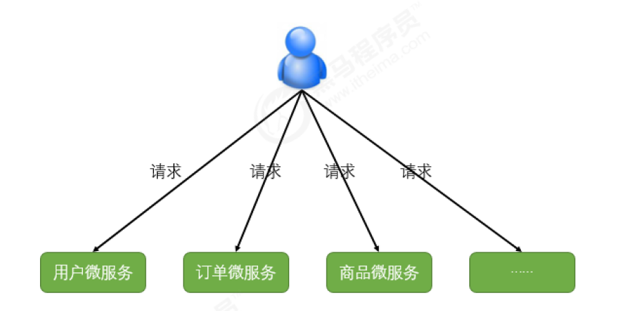
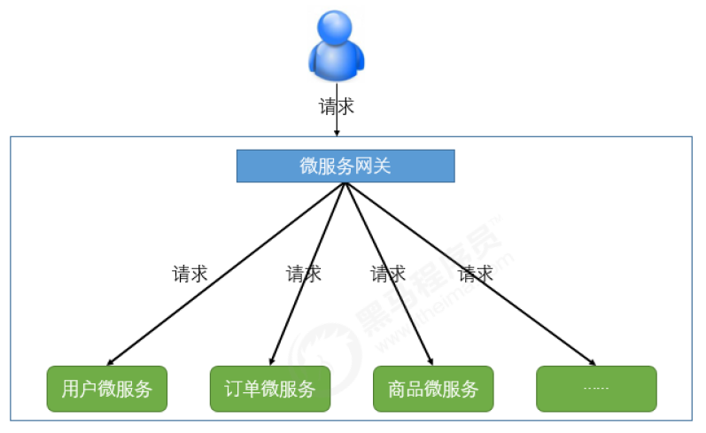

# 微服务网关,链路追踪

## 1 微服务网关概述

不同的微服务一般会有不同的网
络地址，客户端在访问这些微服务时必须记住几十甚至几百个地址，这对于客户端方来说太复杂也难以
维护。如下图：
如

如果让客户端直接与各个微服务通讯，可能会有很多问题：

- 客户端会请求多个不同的服务，需要维护不同的请求地址，增加开发难度
- 在某些场景下存在跨域请求的问题
- 加大身份认证的难度，每个微服务需要独立认证

因此，我们需要一个微服务网关，介于客户端与服务器之间的中间层，所有的外部请求都会先经过微服
务网关。客户端只需要与网关交互，只知道一个网关地址即可，这样简化了开发还有以下优点：

1、易于监控
2、易于认证
3、减少了客户端与各个微服务之间的交互次数

### 1.1 服务网关的概念

#### 1.1.1 什么是微服务网关

API网关是一个服务器，是系统对外的唯一入口。API网关封装了系统内部架构，为每个客户端提供
一个定制的API。API网关方式的核心要点是，所有的客户端和消费端都通过统一的网关接入微服务，在
网关层处理所有的非业务功能。通常，网关也是提供REST/HTTP的访问API。服务端通过API-GW注册和
管理服务。

#### 1.1.2 作用和应用场景

网关具有的职责，如身份验证、监控、负载均衡、缓存、请求分片与管理、静态响应处理。当然，最主
要的职责还是与“外界联系”。

### 1.2 常见的API网关实现方式

- Kong
  基于Nginx+Lua开发，性能高，稳定，有多个可用的插件(限流、鉴权等等)可以开箱即用。
  问题：只支持Http协议；二次开发，自由扩展困难；提供管理API，缺乏更易用的管控、配置方
  式。
- Zuul
  Netflix开源，功能丰富，使用JAVA开发，易于二次开发；需要运行在web容器中，如Tomcat。
  问题：缺乏管控，无法动态配置；依赖组件较多；处理Http请求依赖的是Web容器，性能不如
  Nginx；
- Traefik
  Go语言开发；轻量易用；提供大多数的功能：服务路由，负载均衡等等；提供WebUI
  问题：二进制文件部署，二次开发难度大；UI更多的是监控，缺乏配置、管理能力；
- Spring Cloud Gateway
  SpringCloud提供的网关服务
- Nginx+lua实现
  使用Nginx的反向代理和负载均衡可实现对api服务器的负载均衡及高可用
  问题：自注册的问题和网关本身的扩展性

## 2 微服务网关Zuul

### 2.1 Zuul简介

ZUUL是Netflix开源的微服务网关，它可以和Eureka、Ribbon、Hystrix等组件配合使用，Zuul组件的
核心是一系列的过滤器，这些过滤器可以完成以下功能：

- 动态路由：动态将请求路由到不同后端集群
- 压力测试：逐渐增加指向集群的流量，以了解性能
- 负载分配：为每一种负载类型分配对应容量，并弃用超出限定值的请求
- 静态响应处理：边缘位置进行响应，避免转发到内部集群
- 身份认证和安全: 识别每一个资源的验证要求，并拒绝那些不符的请求。Spring Cloud对Zuul进行
  了整合和增强。

### 2.2 搭建Zuul网关服务器

### 2.3 Zuul中的路由转发

### 2.4 Zuul中的过滤器

### 2.5 服务网关Zuul的核心源码解析

#### （1）初始化

#### （2）请求转发

#### （3）过滤器

### 2.6 Zuul网关存在的问题

- 性能问题
- 不支持任何长连接，如websocket

### 2.7 Zuul网关的替换方案

#### Zuul2.x版本

#### SpringCloud Gateway

## 3 微服务网关GateWay

Zuul 1.x 是一个基于阻塞 IO 的 API Gateway 以及 Servlet；直到 2018 年 5 月，Zuul 2.x（基于
Netty，也是非阻塞的，支持长连接）才发布，但 Spring Cloud 暂时还没有整合计划。Spring Cloud
Gateway 比 Zuul 1.x 系列的性能和功能整体要好。

### 3.1 Gateway简介

Spring Cloud Gateway 是 Spring 官方基于 Spring 5.0，Spring Boot 2.0 和 Project Reactor 等技术开
发的网关，旨在为微服务架构提供一种简单而有效的统一的 API 路由管理方式，统一访问接口。

#### 3.1.2 核心概念

1. **路由（route）** 路由是网关最基础的部分，路由信息由一个ID、一个目的URL、一组断言工厂和一
组Filter组成。如果断言为真，则说明请求URL和配置的路由匹配。
2. **断言（predicates）** Java8中的断言函数，Spring Cloud Gateway中的断言函数输入类型是
Spring5.0框架中的ServerWebExchange。Spring Cloud Gateway中的断言函数允许开发者去定
义匹配来自Http Request中的任何信息，比如请求头和参数等。
3. **过滤器（filter）** 一个标准的Spring webFilter，Spring Cloud Gateway中的Filter分为两种类型，
分别是Gateway Filter和Global Filter。过滤器Filter可以对请求和响应进行处理。

### 3.2 入门案例

### 3.3 过滤器

### 3.4 统一鉴权

### 3.5 网关限流

#### 3.5.1 常见的限流算法

##### （1） 计数器

是通过维护一个单位时间内的计数器，每次请求
计数器加1，当单位时间内计数器累加到大于设定的阈值，则之后的请求都被拒绝，直到单位时间已经
过去，再将计数器重置为零

##### （2） 漏桶算法

漏桶可以看作是一个带有常量服务时间的
单服务器队列，如果漏桶（包缓存）溢出，那么数据包会被丢弃。 在网络中，漏桶算法可以控制端口的
流量输出速率，平滑网络上的突发流量，实现流量整形，从而为网络提供一个稳定的流量。

为了更好的控制流量，漏桶算法需要通过两个变量进行控制：一个是桶的大小，支持流量突发增多时可
以存多少的水（burst），另一个是水桶漏洞的大小（rate）。

##### （3） 令牌桶算法

令牌桶算法是对漏桶算法的一种改进，桶算法能够限制请求调用的速率，而令牌桶算法能够在限制调用
的平均速率的同时还允许一定程度的突发调用。在令牌桶算法中，存在一个桶，用来存放固定数量的令
牌。算法中存在一种机制，以一定的速率往桶中放令牌。每次请求调用需要先获取令牌，只有拿到令
牌，才有机会继续执行，否则选择选择等待可用的令牌、或者直接拒绝。

#### 3.5.2 基于Filter的限流

#### 3.5.3 基于Sentinel的限流

### 3.6 网关高可用

集群就可以了

## 4 微服务的链路追踪概述

### 4.1 微服务架构下的问题

- 如何快速发现问题？
- 如何判断故障影响范围？
- 如何梳理服务依赖以及依赖的合理性？
- 如何分析链路性能问题以及实时容量规划？

目前业界比较流行的链路追踪系统如：

- Twitter的Zipkin，
- 阿里的鹰眼，
- 美团的Mtrace
- 大众点评的cat等

大部分都是基于google发表的Dapper。Dapper阐述了分布式系统，特别是微服务架构中链路
追踪的概念、数据表示、埋点、传递、收集、存储与展示等技术细节。

### 4.2 Sleuth概述

#### 4.2.1 简介

Spring Cloud Sleuth 主要功能就是在分布式系统中提供追踪解决方案，并且兼容支持了 zipkin，你只
需要在pom文件中引入相应的依赖即可。

#### 4.2.2 相关概念

先来了解一下Sleuth中的术语和相关概念。

**Span：基本工作单元，**例如，在一个新建的span中发送一个RPC等同于发送一个回应请求给
RPC，span通过一个64位ID唯一标识，trace以另一个64位ID表示，span还有其他数据信息，比
如摘要、时间戳事件、关键值注释(tags)、span的ID、以及进度ID(通常是IP地址)
span在不断的启动和停止，同时记录了时间信息，当你创建了一个span，你必须在未来的某个时
刻停止它。

**Trace：一系列spans组成的一个树状结构，**例如，如果你正在跑一个分布式大数据工程，你可能
需要创建一个trace。
**Annotation：用来及时记录一个事件的存在，**一些核心annotations用来定义一个请求的开始和结
束
cs - Client Sent -客户端发起一个请求，这个annotion描述了这个span的开始
sr - Server Received -服务端获得请求并准备开始处理它，如果将其sr减去cs时间戳便可得到
网络延迟
ss - Server Sent -注解表明请求处理的完成(当请求返回客户端)，如果ss减去sr时间戳便可得
到服务端需要的处理请求时间
cr - Client Received -表明span的结束，客户端成功接收到服务端的回复，如果cr减去cs时间
戳便可得到客户端从服务端获取回复的所有所需时间

### 4.3 链路追踪Sleuth入门

### 4.4 Zipkin的概述

### 4.5 Zipkin Server的部署和配置

### 4.6 客户端Zipkin+Sleuth整合

### 4.7 基于消息中间件收集数据

### 4.8 存储跟踪数据